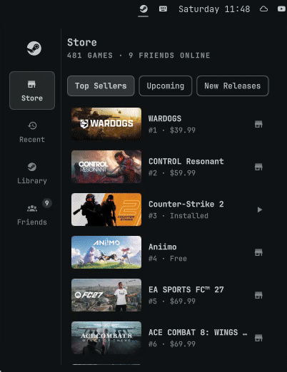
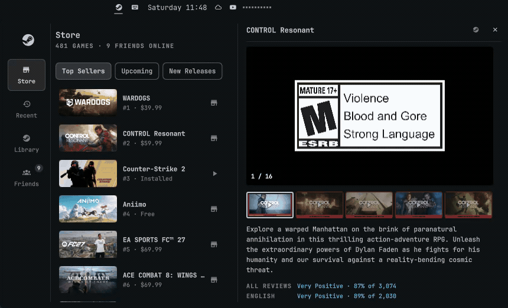

# Steam for Omarchy

A bar widget for [Omarchy](https://omarchy.org)'s shell that puts Steam in a popup:

<p>
  
  
</p>

- **Store**: the store's top 50 sellers, popular upcoming games and popular new releases.
  Click a game you don't own (or press `i` on any game) to open its store page right in the
  popup: trailers and screenshots, description, reviews, tags, Steam Deck status, system
  requirements and the most helpful reviews. Buying opens Steam.
- **Recent**: your recently played, installed games. Click to play.
- **Library**: everything you own, searchable (`/`). Uninstalled games install to the drive of
  your choice.
- **Downloads**: live progress, speed and time left, with pause/resume. Collapse the section
  with its header or `d`.
- **Friends**: who's online and what they're playing, with chat in the popup.

It reads the Steam client's own files, so there's no sign-in or API key to set up.

## Install

```sh
omarchy plugin add https://github.com/BlippyOhNo/omarchy-steam.git --enable
```

Then log in to Steam (native `steam` or the Flatpak). The widget shows the account that last
logged in on the machine.

Everything it needs ships with Omarchy: Python 3, `jq`, ImageMagick (store page art is AVIF,
which Qt can't show, so it's converted) and Qt Multimedia (trailers).

### Optional: install, pause and chat from the popup

Steam has no command line for installing into a chosen folder, pausing downloads or chatting.
The widget does those through Steam's local debugging port, which is off by default. To turn it
on, create this file and restart Steam:

```sh
touch ~/.local/share/Steam/.cef-enable-remote-debugging
# Flatpak Steam: ~/.var/app/com.valvesoftware.Steam/.local/share/Steam/.cef-enable-remote-debugging
```

While it's on, **any program on your computer can control your Steam client** through
`localhost:8080`. Without it the widget still works: installs and chat open in Steam, and
pause/resume is hidden.

## Settings

In the widget's settings:

- **Games in Recent**: how many recently played games to show.
- **Install new games to**: text matched against your Steam library folders' paths (e.g. `GAMES`
  for `/run/media/you/GAMES/SteamLibrary`). Empty uses Steam's default folder.
- **Steam Web API key** (optional, from [steamcommunity.com/dev/apikey](https://steamcommunity.com/dev/apikey)):
  faster, exact friend status. Without one, status is read from each friend's public profile.

## Keys

| Key | Action |
| --- | --- |
| `1`–`4` | Store, Recent, Library, Friends |
| `←` `→` | Previous/next list or tab (flip media when a store page is open) |
| `↑` `↓`, `Enter` | Move, then play / install / open |
| `i` | Store page for the selected game |
| `PgUp` `PgDn` | Scroll the store page |
| `/` | Search the library |
| `d` | Collapse or expand downloads |
| `x` `x` | Uninstall the selected game |
| `r` | Refresh |
| `Esc` | Close the store page, then the popup |

From a script or keybinding:

```sh
omarchy-shell blip.steam toggle
omarchy-shell blip.steam tab store        # store | recent | library | friends
omarchy-shell blip.steam store 1091500    # open a game's store page by app id
```

## What it talks to

Local Steam files (library, playtime, friends list, downloads) and, over HTTPS, Steam's public
store and community endpoints. Store lists are cached for an hour and store pages for six hours
in `~/.cache/blip-steam`. Prices are in US dollars.

## Update / remove

```sh
omarchy plugin update blip.steam
omarchy plugin remove blip.steam
```

## License

MIT, see [LICENSE](LICENSE).
